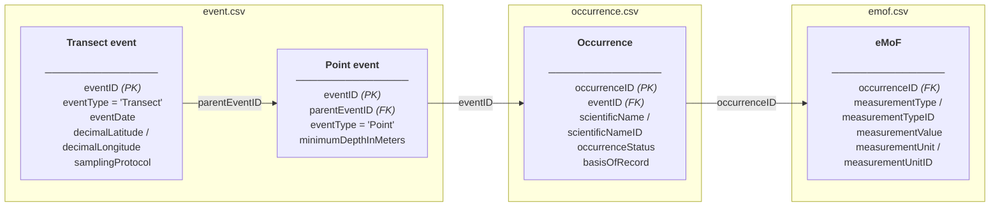

# obis-example

Materials for the OBIS June 2026 workshop.

## Darwin Core Archive structure

The three output files are linked by shared identifiers:

```mermaid
flowchart LR
    subgraph event.csv
        direction TB
        PE["<b>Transect event</b>
        ────────────────
        eventID <i>(PK)</i>
        eventType = 'Transect'
        eventDate
        decimalLatitude / decimalLongitude
        samplingProtocol"]

        CE["<b>Point event</b>
        ────────────────
        eventID <i>(PK)</i>
        parentEventID <i>(FK)</i>
        eventType = 'Point'
        minimumDepthInMeters"]

        PE -->|parentEventID| CE
    end

    subgraph occurrence.csv
        OCC["<b>Occurrence</b>
        ────────────────
        occurrenceID <i>(PK)</i>
        eventID <i>(FK)</i>
        scientificName / scientificNameID
        occurrenceStatus
        basisOfRecord"]
    end

    subgraph emof.csv
        EMOF["<b>eMoF</b>
        ────────────────
        occurrenceID <i>(FK)</i>
        measurementType / measurementTypeID
        measurementValue
        measurementUnit / measurementUnitID"]
    end

    CE -->|eventID| OCC
    OCC -->|occurrenceID| EMOF
```